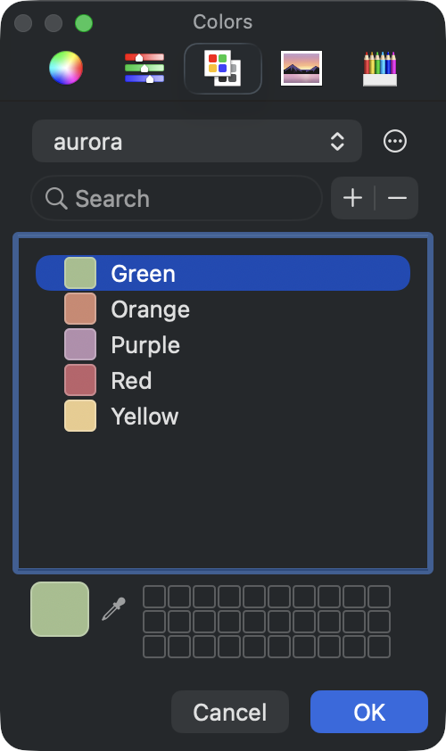

# json2clr


Convert JSON color palettes to macOS `.clr` color lists — custom colors for Microsoft Office, Keynote, Pages, and any app that uses the native color picker.

 

## What it does

macOS stores custom color palettes as `.clr` files in `~/Library/Colors/`. Once installed, they appear in the system color picker — the palette panel shared by every native and Cocoa-based app.

This means one `.clr` file gives brand colors to:

- **Microsoft Office** — Word, Excel, PowerPoint, Outlook
- **Apple iWork** — Pages, Numbers, Keynote
- **Design tools** — Sketch, Figma (Mac app), Pixelmator
- **Developer tools** — Xcode, Interface Builder
- **Any app** that uses `NSColorPanel`

json2clr reads a JSON file of named hex colors, displays each with a terminal swatch and color space breakdown (RGB, HSL, CMYK), and exports the palette as a `.clr` file — or installs it directly where the color picker can find it.

## Install

Requires macOS 14+ (Sonoma) and Swift 6.0.

```sh
git clone https://github.com/ansilithic/json2clr.git
cd json2clr
make build && make install
```

## Usage

```
json2clr <file> [--clr] [--install] [--output <output>]
```

| Flag | Description |
|---|---|
| `<file>` | Path to a JSON color palette file |
| `--clr` | Export as macOS color list (`.clr`) |
| `--install` | Install `.clr` to `~/Library/Colors` |
| `-o, --output` | Output file path for `.clr` export |

## Examples

```bash
# Inspect a palette in the terminal
json2clr palette.json

# Export to .clr file
json2clr palette.json --clr

# Export to a specific path
json2clr palette.json --clr -o ~/Desktop/BrandColors.clr

# Install directly to the macOS color picker
json2clr palette.json --install
```

After `--install`, open any app → color picker → palette tab → the new palette appears immediately.

## Input format

A flat JSON object mapping color names to hex values:

```json
{
  "Red": "#BF616A",
  "Orange": "#D08770",
  "Yellow": "#EBCB8B",
  "Green": "#A3BE8C",
  "Purple": "#B48EAD"
}
```

Hex values work with or without a `#` prefix.

## License

MIT
