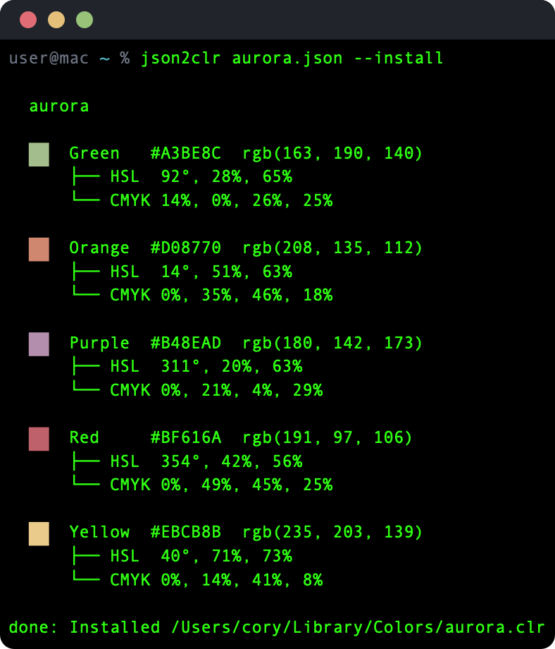
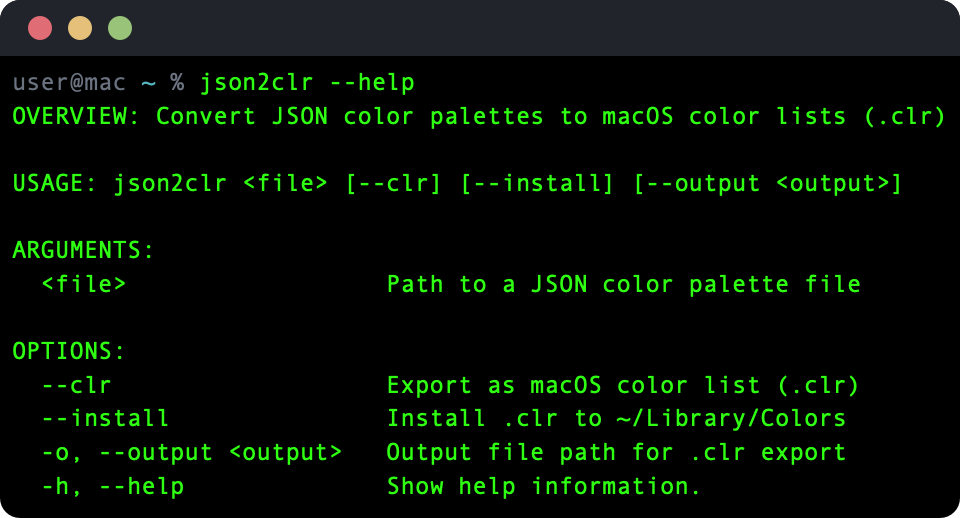

# json2clr


Convert JSON color palettes to macOS color lists (`.clr`) with inline analysis — hex, RGB, HSL, CMYK, and WCAG contrast ratios at a glance.



## What it does

json2clr reads a JSON file containing named colors, displays each color with a terminal swatch and full color space breakdown (HSL, CMYK), and evaluates WCAG contrast ratios against white and black backgrounds. Colors that fail accessibility thresholds are flagged.

Optionally, the palette can be exported as a macOS `.clr` color list — the native format used by the system color picker in any Cocoa app — or installed directly to `~/Library/Colors` where it appears in the color picker automatically.

## Install

Requires Swift 6.0+ and macOS 14+.

```sh
make build
make install
```

This builds a release binary and copies it to `/usr/local/bin/json2clr`.



## Usage

```
json2clr <file> [--clr] [--install] [--output <output>]
```

| Flag | Description |
|---|---|
| `<file>` | Path to a JSON color palette file |
| `--clr` | Export as macOS color list (`.clr`) |
| `--install` | Install `.clr` to `~/Library/Colors` |
| `-o, --output` | Output file path for `.clr` export |

## Examples

```bash
# Inspect a palette in the terminal
json2clr palette.json

# Export to .clr file
json2clr palette.json --clr

# Export to a specific path
json2clr palette.json --clr -o ~/Desktop/MyColors.clr

# Install directly to the macOS color picker
json2clr palette.json --install
```

## Input format

A flat JSON object mapping color names to hex values:

```json
{
  "Red": "#BF616A",
  "Orange": "#D08770",
  "Yellow": "#EBCB8B",
  "Green": "#A3BE8C",
  "Purple": "#B48EAD"
}
```

Hex values work with or without a `#` prefix.

## License

MIT
